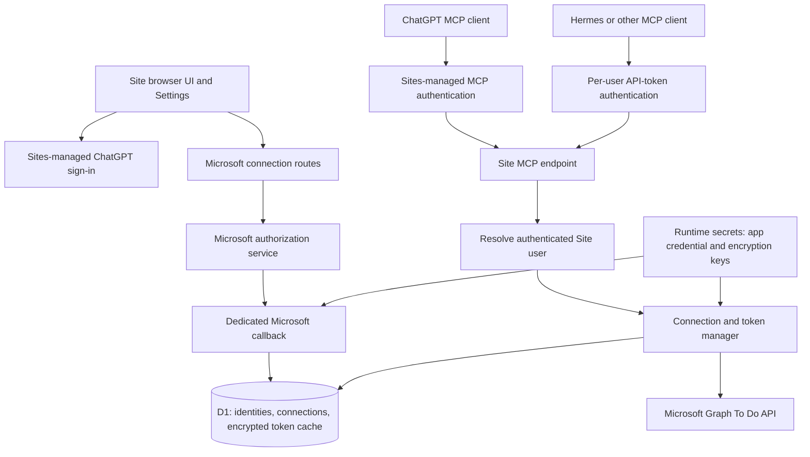

# Microsoft To Do MCP on ChatGPT Sites

## Product requirements document

| Field | Value |
| --- | --- |
| Version | 1.0 |
| Date | October 1, 2026 |
| Stage | Design and feasibility review; implementation has not started |
| Primary platform | ChatGPT Sites |
| External service | Microsoft To Do through Microsoft Graph |
| Clients | ChatGPT and other MCP agents, including Hermes |
| Initial audience | Multiple independent personal ChatGPT accounts and personal Microsoft accounts |

### Reading this document

This PRD records the decisions made in the conversation, describes the proposed implementation, and preserves unresolved feasibility questions. It does not claim that a deployed integration has been tested or that every Sites distribution route is available.

Requirements use the following labels:

- **Decided:** an explicit user requirement or an architectural choice established in the conversation.
- **Proposed:** a concrete implementation detail or product default supplied here to make the design actionable. It may be refined during implementation.
- **Verification gate:** a platform behavior, eligibility condition, or integration assumption that must be checked before the dependent capability can be promised or released.

The preferred design uses normal Microsoft browser authorization. Device code was previously discussed as a workaround for callback uncertainty; it is not the selected default and is not a documented Sites requirement.

## 1. Product summary

Build a multiuser Microsoft To Do integration hosted as a ChatGPT Site with an MCP server. A user signs into the Site with ChatGPT, connects their own Microsoft account, and grants delegated access to their To Do data. The Site subsequently performs Microsoft Graph operations on behalf of that user.

The same connection must serve two client paths:

1. **ChatGPT:** an installed Site plugin/app or another verified ChatGPT connection path invokes the MCP server with an authenticated caller identity.
2. **Other agents:** a user creates a personal API token in the Site's Settings page and supplies it to a compatible remote MCP client, such as Hermes.

Both paths resolve to the same internal Site user and that user's Microsoft connection. One person's Microsoft credentials must never be used to satisfy another person's request.

This is a delegated authorization product. ChatGPT authentication establishes who is calling the Site; Microsoft authorization separately establishes which Microsoft account the Site may access. Linking the accounts requires an explicit user action and consent. After linking, ordinary requests should use the correct connection automatically until authorization expires, is revoked, or otherwise requires reconnecting.

## 2. Goals and success criteria

### 2.1 Goals

- Give agents a practical way to read and manage Microsoft To Do through MCP.
- Support multiple users with independent ChatGPT and Microsoft accounts.
- Provide a browser Settings page for Microsoft connections and headless API tokens.
- Preserve Sites-managed ChatGPT authentication and its MCP connection behavior.
- Store and use Microsoft credentials on the server with encryption and strict ownership controls.
- Make headless access possible after a user completes the initial browser setup.
- Resolve the remaining Sites callback and distribution questions before committing to a production launch.

### 2.2 Success criteria

The initial release is successful when:

- Two distinct Site users can independently link different personal Microsoft accounts.
- Each user can list their own To Do lists and tasks and perform the supported task operations.
- Neither ChatGPT calls nor API-token calls can access another user's connection or task data.
- A user can create, use, and revoke a personal MCP API token.
- Expired Microsoft access tokens can be refreshed without requiring a browser on every request.
- Revoked or unusable Microsoft authorization produces an actionable reconnect response.
- The selected ChatGPT installation path works for an account outside the developer's account or workspace.
- Microsoft credentials and headless API tokens do not appear in prompts, MCP results, client bundles, or ordinary logs.

These are acceptance requirements for future implementation; they have not been demonstrated yet.

### 2.3 Non-goals for the initial release

- A full replacement for the Microsoft To Do user interface.
- Access using the developer's Microsoft account on behalf of all users.
- Application-only/background access to personal To Do without user consent.
- Shared organizational task administration, Microsoft Planner, Outlook mail, or calendar access.
- Multiple concurrently active Microsoft accounts for one Site user.
- Building an independent identity provider to replace Sites' ChatGPT sign-in.
- A commitment to support every MCP client or every ChatGPT subscription tier.
- Public catalog publication before the canonical Sites app submission path is confirmed.

The one-active-Microsoft-account limit is **proposed**. The user's confirmed requirement is multiple users with separate account connections, not multiple connections per user.

## 3. Decisions recorded so far

| Topic | Decision or current status |
| --- | --- |
| Hosting | **Decided:** use ChatGPT Sites as the intended website and MCP host. |
| Product audience | **Decided:** multiple independent personal ChatGPT accounts, not one shared Business/Enterprise workspace. |
| Microsoft audience | **Decided:** personal Microsoft accounts are required. Work/school accounts are a possible later extension. |
| Site identity | **Decided:** use Sites-managed ChatGPT authentication and a stable, trusted user ID, rather than email as the ownership key. |
| Microsoft authorization | **Decided:** users explicitly link and consent to their own Microsoft account. |
| Preferred Microsoft flow | **Decided:** authorization code flow with PKCE through the browser, subject to the Sites callback verification gate. |
| Device code | Optional fallback only; no evidence establishes it as required by Sites. |
| Microsoft API | **Decided:** Microsoft Graph To Do endpoints with delegated permissions. |
| Credential storage | **Decided:** server-side encrypted Microsoft token storage, with encryption material held separately in runtime secrets. |
| User isolation | **Decided:** every data operation resolves the authenticated caller to that caller's Microsoft connection. |
| Settings | **Decided:** provide Microsoft connection controls and personal API-token generation/revocation. |
| Other agents | **Decided:** support headless MCP authentication with Site-issued per-user API tokens. |
| Shared hosting bypass token | **Decided:** never use a shared Sites service credential as an end-user identity or Microsoft consent substitute. |
| Companion service | No separate Microsoft token service is currently required by the proposed architecture; necessity remains dependent on the callback/platform checks. |
| Microsoft app registration | Required once for our application. The developer has not confirmed an existing Entra tenant or registration access. |
| Public distribution | Unresolved. A public Site URL alone does not distribute or install a ChatGPT plugin. |
| Build status | No Site, app registration, secrets, or implementation have been created as part of this design work. |

## 4. Users and primary journeys

### 4.1 User types

- **ChatGPT user:** wants To Do tools available during normal ChatGPT conversations.
- **Headless agent user:** wants Hermes or another remote MCP client to use the same Microsoft connection.
- **Developer/operator:** registers the Microsoft application, configures the Site, manages deployment and secrets, and operates the service.

Users do not need their own Azure subscription or app registration. They authenticate to Microsoft and consent to our registered application.

### 4.2 First connection

1. The user opens the Site and signs in with ChatGPT.
2. Settings identifies the signed-in Site user and shows that Microsoft is not connected.
3. The user selects **Connect Microsoft**.
4. The Site starts a Microsoft authorization transaction bound to that Site user.
5. Microsoft authenticates the user and requests the necessary delegated permissions.
6. Microsoft returns the browser to the Site's dedicated Microsoft callback route.
7. The server verifies the transaction and exchanges the code for tokens.
8. The server stores an encrypted token cache belonging to that Site user.
9. Settings shows the linked Microsoft account and connection status.

Declined consent or a cancelled sign-in leaves the Site user authenticated but Microsoft unconnected.

### 4.3 Use through ChatGPT

1. The user installs/connects the integration through the verified distribution path.
2. ChatGPT invokes a To Do tool.
3. The Site derives the authenticated caller from the supported hosting/connection context.
4. It retrieves that caller's Microsoft connection and refreshes tokens if necessary.
5. It calls Microsoft Graph and returns the tool result.

If no Microsoft account is linked, the result directs the user to the Site's Settings page. The tool must not initiate a hidden authorization flow, guess an account, or use another user's connection.

### 4.4 Use through Hermes or another agent

1. The user completes Microsoft linking in the Site's browser UI.
2. In Settings, they create a token with a label, permissions, and expiration.
3. The Site displays the token once and gives connection instructions.
4. The user configures the remote MCP endpoint and supported authentication header in their agent.
5. Calls resolve the token to its owning Site user and then to that user's Microsoft connection.

Headless means no browser is needed for ordinary subsequent calls. Initial consent and later reconnection can still require the browser.

## 5. System architecture and important components

### 5.1 Components

| Component | Responsibility |
| --- | --- |
| Sites browser UI | Sign-in, connection status, API-token management, setup instructions. |
| Sites-managed sign-in | Authenticate ChatGPT users and provide trusted identity context. |
| Site server/Worker | HTTP routes, Microsoft authorization transactions, Graph requests, MCP handling, authorization decisions. |
| Dedicated Microsoft routes | Initiate linking and handle Microsoft redirects without replacing Sites sign-in. |
| MCP server | Stateless HTTP tool discovery and execution at `/mcp`. |
| Identity resolver | Convert a managed caller or valid API token into a canonical Site user ID. |
| Microsoft token manager | Encrypt/decrypt caches, acquire/refresh access tokens, track reconnect conditions. |
| Graph adapter | Validate operations, call documented To Do endpoints, handle pagination and upstream errors. |
| D1 database | Durable users, connections, authorization transactions, API-token metadata, minimal operational records. |
| Runtime secret store | Microsoft app credential, token-encryption keys, and any token-verification secret required by the implementation. |
| Canonical Site app/plugin | Connect Site tools to supported ChatGPT/Codex surfaces without creating duplicate private bindings. |

R2/object storage is available on Sites but is not needed for the proposed initial release. Do not add it merely because it exists.

### 5.2 Hosting constraints

- Declare the Site's MCP capability through the supported Sites configuration.
- Preserve the Sites starter integration and bundled authentication helpers.
- Preserve Sites-managed OAuth for the ChatGPT-to-Site connection.
- Do not implement application routes at `/signin-with-chatgpt`, `/signout-with-chatgpt`, or `/callback`; Sites dispatch owns these paths.
- Use a separate proposed Microsoft callback such as `/api/microsoft/oauth-return`.
- Keep secrets out of source, frontend bundles, and `.openai/hosting.json`.
- Sites supports outbound HTTPS, which the Microsoft authorization and Graph integrations require.
- Runtime secret changes require the supported deployment/redeployment procedure.

Custom route reachability and identity/session behavior on return from Microsoft remain a verification gate.

## 6. Identity, ownership, and authorization

### 6.1 Canonical ownership

The canonical owner key is the trusted Sites user ID. The documented header is `oai-authenticated-user-id`; browser server code should use the provided Sites authentication helpers where applicable.

The ID is stable for a user within a Site and differs across Sites. Email is display/contact data, not an ownership key. A Microsoft account identifier is connection metadata, not a substitute for the Site owner.

Requests must not select their owner through a tool argument such as `user_id`, a query parameter, or a client-supplied email address. Caller-controlled account/task/list identifiers are never sufficient authorization.

Managed MCP and browser calls must resolve to the same canonical identity, or to an explicit verified mapping. This cannot be assumed merely because both display the same email address. Any direct developer-mode connection must be checked for this identity consistency.

### 6.2 Distinct credentials

| Credential | What it authorizes | Storage/use |
| --- | --- | --- |
| Sites-managed ChatGPT authentication | Identifies the caller to the Site through supported platform mechanisms. | Managed by Sites; our server consumes trusted context. |
| Microsoft app secret/certificate | Authenticates our registered confidential application at Microsoft's token endpoint. | Server runtime secret; never a browser or MCP result. |
| Microsoft access token | Calls Graph with one user's delegated permissions. | Encrypted server cache; used only against the intended Microsoft endpoint. |
| Microsoft refresh token/cache | Renews that user's delegated access when Microsoft permits it. | Encrypted server cache; never given to agent clients. |
| Site-issued personal API token | Authorizes a headless agent as one Site user with bounded local permissions. | Client holds plaintext; server stores a verifier and metadata. |
| Sites service/bypass credential | Passes a hosting access boundary where supported. | Operator/platform access only; does not identify an end user or grant Microsoft consent. |

A Microsoft application credential alone cannot access a user's To Do. Microsoft delegated authorization is still required.

### 6.3 Authorization rules

- Resolve the caller before every private data operation.
- Reject missing, invalid, expired, or revoked credentials.
- Fetch the Microsoft connection only by the resolved owner.
- Apply the API token's local permissions before Graph access.
- Operate through that user's delegated Microsoft context, normally `/me/todo/...`.
- Reject contradictory simultaneous user credentials rather than silently switching identities.
- A signed-in user can manage only their own connections and API tokens.
- Tool discovery must not expose private connection metadata or task content.
- Managed identity headers must be trusted only when supplied/protected by the hosting boundary. Verify that public callers cannot spoof them.

Microsoft is authoritative for its account permissions; our service is authoritative for which Site user may use a stored connection.

## 7. Microsoft registration and browser authorization

### 7.1 Developer prerequisites

The operator must obtain access to a Microsoft Entra directory and register our application. The operator currently has no confirmed registration access.

Official Microsoft documentation provides a free Azure signup path with a default Entra directory. A paid Microsoft 365 subscription or Entra premium license is not a stated requirement for this basic app registration. Azure signup can require a phone number and payment card for verification. Creating additional workforce tenants under a free/trial subscription is restricted; use the default directory rather than assuming arbitrary tenant creation is available.

The free signup path and ongoing eligibility must be confirmed in the operator's actual account. Free app registration does not imply that every possible Azure hosting service is free; the planned runtime is Sites.

### 7.2 Registration configuration

For the preferred browser flow:

1. Sign up for/access Azure and select the default Entra directory.
2. Open Microsoft Entra's **App registrations** and register the application.
3. Select support for personal Microsoft accounts. Supporting both organizational and personal accounts is an optional scope expansion.
4. Add a **Web** redirect URI that exactly matches the stable deployed Microsoft callback URL.
5. Add Microsoft Graph delegated `Tasks.ReadWrite` permission.
6. Configure a confidential application credential using an appropriate secret or certificate.
7. Record the application/client ID and authority configuration. Store the application credential only as a server runtime secret.

Use the personal-account authority (`consumers`) for a personal-only registration, or the appropriate authority for the selected supported-account audience.

Do not enable public-client flows merely to implement the normal confidential web flow. Earlier device-code suggestions to leave the redirect URI blank and enable public-client flows do not apply to this chosen design.

### 7.3 Permissions

- `Tasks.ReadWrite`: delegated access required for the initial task management capability.
- `offline_access`: request continued delegated access through refresh tokens.
- `openid` and, if needed, `profile`: proposed for obtaining a stable Microsoft subject/display identity using validated identity tokens.
- Avoid additional Graph permissions such as `User.Read` unless implementation demonstrates a specific need.

The requested OAuth scopes and actual granted scopes must be recorded and checked. A locally read-only API token still operates through the same Microsoft connection, but our server must prevent write tools from using it.

Microsoft Graph's documented To Do task creation permissions support delegated personal and work/school access and do not support application permissions. The selected design therefore depends on per-user consent, not client-credentials access.

### 7.4 Authorization transaction requirements

The server must:

- Require an authenticated Site user before beginning linking.
- Create a cryptographically random, short-lived, one-time `state` value.
- Generate a PKCE verifier and S256 challenge and bind the verifier to the transaction.
- Store the transaction owner, purpose, creation/expiry, and allowed return path server-side.
- Send an exact registered redirect URI to Microsoft.
- Validate state, expiry, transaction ownership, provider errors, and replay status on return.
- Verify the current Site identity matches the initiating user, or use an explicitly reviewed reauthentication completion procedure that preserves that binding.
- Never assign a connection based on an owner ID supplied by the callback query string.
- Exchange the code server-side using the verifier and application credential.
- Validate any identity token used to identify the Microsoft account, including issuer, audience, and nonce where used.
- Persist the encrypted connection only after all checks succeed.
- Consume the transaction and return the browser to a clean Settings URL.

If the callback loses the Site session, fail safely or use the reviewed completion procedure; do not silently attach the account to whichever user next signs in.

Use a Microsoft-supported library where compatible with the Sites runtime. Otherwise, any protocol implementation must be reviewed against the official flow requirements. Library/runtime compatibility remains an implementation check.

### 7.5 Reconnect, disconnect, and account replacement

- Reconnect requires the signed-in owner and a new Microsoft authorization transaction.
- Display the account being connected before confirming replacement of an existing account.
- Replace the stored cache only after successful authorization, preserving a working connection if the new attempt is cancelled.
- **Proposed:** invalidate existing headless tokens when the user intentionally changes to a different Microsoft account, so previously configured agents cannot silently gain access to the replacement account.
- Disconnect immediately removes local access to the Microsoft connection and deletes stored credential material.
- Explain that disconnecting locally is separate from revoking the application's consent in Microsoft account settings. Do not claim global consent revocation unless a supported mechanism is actually implemented.

### 7.6 Device-code fallback

Device code is an optional alternative if the callback path is unavailable and the user chooses to retain Sites. It has different public-client registration requirements and must be deliberately reviewed before switching.

It is not needed just because an eventual MCP client is headless: the user can authorize once in the Site's browser UI and let headless clients use Site API tokens afterward.

## 8. Token storage and lifecycle

### 8.1 Storage requirements

- Store Microsoft token material or a serialized token cache as encrypted ciphertext in D1.
- Use authenticated encryption, such as AES-GCM through the Worker runtime's Web Crypto support.
- Generate a fresh unique nonce for each encryption operation; never reuse a nonce with the same key.
- Bind ciphertext to its owner/connection and schema using authenticated additional data where appropriate.
- Keep encryption keys in Sites runtime secrets, separate from the database.
- Version ciphertext and record a key ID to support rotation.
- Never store raw Microsoft tokens in browser storage, tool responses, frontend state, or log events.
- Restrict operational access to database and runtime secrets; encryption does not replace access control.

Proposed runtime configuration includes a Microsoft client ID, authority, callback URL, confidential credential, token-encryption key/key version, and public base URL. Non-secret settings may be ordinary environment variables; credentials and encryption material must be marked secret.

### 8.2 Refresh behavior

- Acquire a sufficiently valid access token before a Graph operation.
- Refresh proactively with a small expiration margin.
- Persist the updated complete token cache, including replacement refresh material when returned.
- Coordinate concurrent refresh attempts for the same connection using a server-safe lock/lease or equivalent, with version checks that prevent stale writes.
- Recover expired leases after crashes and bound retry attempts.
- Classify permanent authorization failures as `reconnect_required` rather than repeatedly retrying.
- Treat transient Microsoft/network failures as retryable within bounded limits.

Refresh tokens do not grant permanent access. Microsoft can revoke them or require interaction. The product must handle this as a normal connection state.

### 8.3 Proposed connection states

`not_connected`, `connecting`, `connected`, `reconnect_required`, and `temporarily_unavailable`.

Temporary upstream failures must not erase a valid token cache or force reconnection automatically. No token status UI may display the underlying credential.

## 9. Site pages and Settings requirements

### 9.1 Pages

| Page | Requirements |
| --- | --- |
| Landing/setup | Explain the integration, supported account types, consent, ChatGPT connection route, and headless setup. Public visibility is proposed, subject to Site access settings. |
| Settings | Requires ChatGPT sign-in; owns Microsoft linking and personal API-token management. |
| Privacy/support | Describe data handling, disconnect/deletion, support contact, and distribution disclosures when required. |

The Site is principally a connection and settings portal. A full task dashboard is outside the initial scope.

### 9.2 Settings: Microsoft connection

- Show signed-in Site identity using safe display data.
- Show connection state and a safe Microsoft account label where available.
- Provide Connect, Reconnect, Replace account, and Disconnect actions as appropriate.
- Explain the requested access in product language.
- Surface cancellation, consent denial, and reconnect instructions without raw provider responses.
- Provide a return path from agent instructions to the correct Settings page.

### 9.3 Settings: personal API tokens

- Require an authenticated owner for creation, listing, and revocation.
- Let the user name a token, choose a permission level, and set an expiration.
- Show a newly created plaintext token once, with a copy action and warning that it cannot be retrieved later.
- List only token metadata: label, safe prefix/identifier, permissions, created date, expiry, status, and coarse last-use time.
- Allow individual revocation and revocation of all personal tokens.
- Provide endpoint/header instructions based on the actually verified client configuration.
- Never provide a token that grants access to multiple users.

**Proposed defaults:** read-only tokens by default, explicit read/write choice, and a 90-day default expiration with a bounded maximum. Final expiration limits are a product default to refine, not a previously approved requirement. Prefer expiring tokens over permanent credentials.

Protect state-changing browser actions against cross-site request forgery and unintended navigation. API-token issuance and Microsoft linking initiation must not use a side-effecting GET.

## 10. Headless MCP authentication

### 10.1 Personal token design

- Generate high-entropy random tokens using a cryptographically secure source.
- Use a recognizable non-secret prefix/identifier for lookup and diagnostics.
- Store only a secure hash/verifier plus owner and metadata; never store recoverable plaintext.
- Verify tokens with an appropriate constant-time comparison where relevant.
- Enforce expiry, revocation, permissions, and rate limits on every applicable request.
- Do not accept tokens through query strings or URLs.
- Do not log authentication headers.

The proposed request header is `X-MCP-API-Key: <personal-token>`, keeping our key distinct from Sites-managed OAuth credentials. The final header must be confirmed against the supported client and hosting path; it is not a claim that all clients accept this header.

**Verification gate:** confirm Hermes can configure the required remote MCP transport and authentication header. If it supports only a different standard header, adapt the public agent authentication route without disrupting managed ChatGPT OAuth.

### 10.2 Public reachability and hosting gates

An external agent must be able to reach an MCP route without a browser session. A public Site can expose that route, with our server enforcing personal-token authorization for private data.

Making a route publicly reachable does not make its data public. Settings still requires ChatGPT sign-in, and To Do operations require an authenticated owner.

Private Sites can have a platform service credential, but that credential does not create a user identity or Microsoft consent. Do not distribute a shared bypass credential to all customers as the headless login mechanism.

**Verification gate:** confirm the chosen Site's publication/access settings permit the intended external MCP requests while preserving the correct identity boundary for managed calls. Do not silently publish a private Site or change its audience to resolve a technical issue.

## 11. MCP interface and To Do tools

### 11.1 Transport and protocol

- Host the initial server at `/mcp` using the stateless HTTP pattern supported by Sites.
- Support MCP initialization, tool discovery, and tool calls through the supported remote HTTP transport.
- Do not require local stdio access to the hosted server.
- Negotiate supported protocol versions using an MCP implementation compatible with the Site runtime.
- Return structured, bounded tool results and understandable errors.
- Discovery may expose tool descriptions and schemas but no user data.

Stream/SSE requirements, protocol details, and Hermes client compatibility must be checked against the selected implementation; generic MCP support is not proof that every client transport combination works.

### 11.2 Proposed initial tool set

The exact catalog was not previously approved. The following provides a concrete useful initial scope:

| Tool | Operation | Local permission |
| --- | --- | --- |
| `todo_connection_status` | Report the caller's connection readiness and a Settings URL. | Read |
| `todo_list_lists` | List the caller's To Do lists. | Read |
| `todo_list_tasks` | List tasks in a caller-accessible list, with bounded pagination. | Read |
| `todo_get_task` | Retrieve one task. | Read |
| `todo_create_task` | Create a task in a selected list. | Write |
| `todo_update_task` | Update supported task fields. | Write |
| `todo_complete_task` | Mark a task complete; reopening can use an explicit status update. | Write |
| `todo_delete_task` | Delete a specified task. | Write |

List creation/renaming/deletion, checklist items, linked resources, attachments, and advanced recurrence are deferred unless explicitly added to scope.

### 11.3 Graph mapping

Use the documented Microsoft Graph v1.0 To Do API:

- `GET /me/todo/lists`
- `GET /me/todo/lists/{listId}/tasks`
- `GET /me/todo/lists/{listId}/tasks/{taskId}`
- `POST /me/todo/lists/{listId}/tasks`
- `PATCH /me/todo/lists/{listId}/tasks/{taskId}`
- `DELETE /me/todo/lists/{listId}/tasks/{taskId}`

Validate each operation and field against the current official endpoint documentation during implementation. MVP writable fields should include title, body, status, importance, and supported date/reminder fields. Date/time and time-zone semantics require explicit handling; do not silently interpret ambiguous local dates.

### 11.4 Tool behavior

- Require explicit list and task identifiers for operations where ambiguity could affect the wrong resource.
- Return relevant IDs and normalized fields, with enough information for the agent to continue the task.
- Bound response sizes and expose continuation cursors for paginated results.
- Keep continuation URLs/cursors constrained to the intended Graph service and operation.
- Describe read, write, and destructive behavior accurately in schemas and MCP annotations. Annotations are hints, not authorization enforcement.
- Treat task titles/bodies as untrusted external content. They must not become instructions that alter caller identity, permissions, or destinations.
- Do not automatically retry a non-idempotent creation after an ambiguous timeout. Use supported deduplication where available or report the uncertain outcome.
- Avoid silent duplicate task creation.
- Destructive operations must be clearly represented so clients can apply their confirmation policies. A dedicated in-tool confirmation flow is a proposed implementation choice, not an established user requirement.

## 12. Proposed server routes and data model

### 12.1 Route outline

| Route | Purpose | Access |
| --- | --- | --- |
| `/settings` | User connection and API-token UI. | ChatGPT-authenticated user |
| `/api/microsoft/connect` | Create transaction and start Microsoft linking. | Owner-authenticated, protected write action |
| `/api/microsoft/oauth-return` | Handle Microsoft authorization response. | Valid transaction plus verified owner/session binding |
| `/api/microsoft/disconnect` | Delete the caller's stored connection. | Owner-authenticated, protected write action |
| `/api/tokens` | List metadata/create personal tokens. | Owner-authenticated; creation is protected |
| `/api/tokens/{id}/revoke` | Revoke an owned token. | Owner-authenticated, protected write action |
| `/mcp` | MCP initialization, discovery, and tools. | Supported managed caller or personal API token for private operations |
| `/health` | Minimal service health without private data. | Proposed operational route |

Paths other than the reserved Sites routes are proposed and may change. The callback URL must be stable and exactly match the Microsoft registration.

### 12.2 Durable records

| Record | Important fields |
| --- | --- |
| `users` | Site user ID, optional safe display data, creation/update timestamps. |
| `microsoft_connections` | Connection ID, owning Site user ID, validated Microsoft account identifier/authority, safe account label, granted scopes, encrypted cache, key version, expiry/status, cache version, timestamps. |
| `oauth_transactions` | State verifier/hash, owner, protected PKCE material, nonce where used, expiry, purpose, permitted return path, one-time consumption state. |
| `api_tokens` | Token ID/prefix, owner, verifier/hash, label, local permissions, creation/expiry/revocation timestamps, coarse last-use timestamp. |
| `refresh_coordination` | Connection/version, lease holder/fencing data, lease expiry as required by the chosen concurrency implementation. |
| `security_events` | Minimal event type, owner/token/connection identifiers where justified, timestamp, correlation ID, sanitized outcome. |

Use foreign keys/unique constraints where supported, parameterized queries, and explicit owner conditions on mutations. Cleanup must remove expired OAuth transactions and obsolete credentials. No durable task-content mirror is required initially.

### 12.3 Data retention

Proposed policy:

- Keep connection data only while connected, with prompt removal on disconnect/account deletion.
- Delete expired authorization transactions promptly; proposed transaction lifetime is approximately 10 minutes.
- Retain only justified token/revocation metadata for a defined operational period.
- Avoid storing task content in logs or audit records.
- Define security-event and backup retention before public launch; no arbitrary permanent retention.
- Document how deletion interacts with provider consent and any backup lifecycle.

Exact retention periods, deletion UX, and privacy text are release decisions to finalize, not already settled choices.

## 13. ChatGPT distribution options

Site visibility, plugin distribution, plugin installation, and Microsoft consent are separate steps. Publishing the website does not automatically make its tools available in every ChatGPT conversation.

### 13.1 Canonical Site app/plugin

Sites can provision a canonical app/private plugin for its MCP tools. Reuse that binding rather than creating duplicate private plugins. This is the intended default connection for the creator through supported Sites tooling.

**Verification gate:** confirm the permitted sharing/installation route for users with independent personal ChatGPT accounts. Documentation for workspace sharing is not proof of arbitrary cross-personal-account sharing.

### 13.2 Distribution choices

| Option | Use case | Conditions and limitations |
| --- | --- | --- |
| Creator's canonical Site plugin | Development and initial owner use. | Verify installation, managed identity, and tools through the actual Site binding. |
| Shared private plugin | Small invited group if platform supports the intended audience. | Cross-personal-account eligibility remains unverified; Site access and plugin access may need separate configuration. |
| ChatGPT developer-mode connection | Technical pilot using a remote MCP endpoint. | Current documented eligibility covers eligible paid/organizational plans, not a promise of ChatGPT Free access. Each user configures/connects; managed auth and identity consistency must be tested. Avoid unnecessarily duplicating canonical private bindings. |
| Public plugin/app catalog | Broad normal ChatGPT distribution. | Requires the applicable submission/review/publication process, privacy/support/listing materials, and confirmation that the path supports the Site's canonical app ownership. |
| Direct MCP connection from Hermes/other agents | Headless access outside ChatGPT. | No ChatGPT catalog review is needed for a direct compatible client, but endpoint reachability, token authentication, and client support must be verified. |

Current developer-mode documentation lists OAuth, no authentication, and mixed authentication; it does not establish arbitrary API-key configuration in normal ChatGPT. Our headless API tokens therefore must not be presented as a substitute for the managed ChatGPT connection flow.

### 13.3 Proposed rollout decision

1. Verify the creator's canonical Site MCP connection.
2. Run a two-user pilot using a supported personal-account distribution/connection route.
3. Verify a direct Hermes API-token connection.
4. Determine whether private sharing is sufficient or public catalog distribution is required.
5. Confirm the canonical Sites submission path before investing in a broad public launch.

If Sites cannot support the required callback or intended distribution path, document the exact constraint and present concrete alternatives. Do not silently switch hosting, replace managed authentication, or manufacture a duplicate plugin to bypass the constraint.

Public submission may require verified developer identity, listing metadata, privacy/support URLs, demonstrations, reviewer access, and review artifacts. Preparation, submission, approval, and publication are distinct stages.

## 14. Security, privacy, and abuse prevention

### 14.1 Required protections

- Enforce owner isolation in server code and database operations.
- Validate the managed identity trust boundary for public and private requests.
- Protect Microsoft linking against CSRF, callback injection, replay, and accidental account substitution.
- Encrypt Microsoft token caches with separately managed keys.
- Store personal API-token verifiers rather than plaintext.
- Require HTTPS and avoid credentials in URLs.
- Redact request authentication headers, authorization codes, cache contents, and provider secrets from logs.
- Keep server-only authentication code out of client imports and bundles.
- Validate request schemas and bound bodies, fields, pagination, and tool results.
- Apply per-user/token throttles and abuse controls without exposing other users' identities.
- Do not provide unrestricted URL-fetching tools or let token material be sent to a client-selected host.
- Separate production and development registrations/data/secrets where feasible.
- Define credential rotation and incident recovery procedures before public release.

### 14.2 Privacy boundaries

- Microsoft tokens remain on the server.
- Agents receive only the task data necessary for the requested operation and safe connection status.
- No developer-wide token is used for customer access.
- The operator's infrastructure can technically process decrypted credentials and task data; encryption at rest is not a claim that the operator can never access them.
- Any public release must explain which data is accessed, why, where it is stored, and how to disconnect/delete it.

## 15. Errors, reliability, and observability

### 15.1 Error classes

| Condition | Product behavior |
| --- | --- |
| Missing/invalid/expired/revoked Site API token | Reject headless access with an actionable authentication failure. |
| Missing managed caller identity | Reject private operation; do not infer user from content. |
| Microsoft not connected | Return a safe Settings link and connect instruction. |
| Microsoft consent denied | Leave connection unchanged and show a retry/cancel result. |
| Callback mismatch, expiry, replay, or different owner | Reject linking; do not persist credentials. |
| Microsoft refresh revoked or interaction required | Mark reconnect required and guide the user to Settings. |
| Graph resource missing/inaccessible | Return an appropriate sanitized resource error without revealing another owner's data. |
| Graph throttling | Respect `Retry-After` where applicable and use bounded retry behavior. |
| Transient network/provider failure | Report temporary unavailability; preserve valid credentials. |
| Ambiguous write timeout | Report uncertain outcome and avoid blind duplication. |
| Internal encryption/configuration failure | Fail closed and emit a redacted operator event. |

Use HTTP authentication/status semantics and MCP error/result semantics appropriate to the supported transport. Preserve platform-managed OAuth challenges where Sites owns them; do not substitute an incompatible custom challenge.

### 15.2 Operational measurements

Collect minimal sanitized measurements for request count/latency, Graph status categories, throttling, authorization success/failure, refresh outcomes, and connection failures. Do not collect raw task bodies, full authorization responses, or credentials for debugging.

Provide correlation IDs and redacted events for operator diagnosis. Bound retention and protect access. API-token last-use updates may be sampled/coarsened to avoid excessive database writes.

### 15.3 Scale and service expectations

The initial target is a small multiuser pilot. No production SLA or unverified maximum user count is promised. Before broader release, assess Worker runtime limits, D1 read/write behavior, Microsoft throttling, token-refresh contention, and the selected plan's Sites quotas.

## 16. Verification gates and unresolved decisions

| Gate | Required evidence | Dependent capability |
| --- | --- | --- |
| G1: Microsoft registration | Actual operator can obtain default directory access, register a personal-account application, and configure delegated permissions/credential. | Any Microsoft connection. |
| G2: Sites browser callback | Real Microsoft authorization round trip reaches a non-reserved Site route, validates state/PKCE, and preserves or safely reestablishes initiating owner binding. | Preferred normal browser flow. |
| G3: Trusted caller identity | Browser and managed MCP callers resolve correctly; public requests cannot spoof managed identity headers. | Multiuser isolation. |
| G4: External MCP reachability | Site access policy permits supported headless requests without handing every user a shared hosting bypass credential. | Hermes/other agents. |
| G5: Hermes compatibility | Actual client supports the chosen HTTP transport and authentication configuration. | Advertised Hermes setup instructions. |
| G6: Independent ChatGPT users | A second personal ChatGPT account can install/connect through an allowed path and obtain the correct user identity. | Multiuser ChatGPT pilot. |
| G7: Public distribution | Confirm the public submission/publishing route for the canonical Site app and actual plan eligibility. | Broad ChatGPT availability. |
| G8: Token/runtime behavior | Compatible libraries, encrypted persistence, refresh, concurrency, and revocation work in the deployed runtime. | Reliable continued access. |

Do not label the design completely proven until the relevant gates pass. Microsoft supports the selected OAuth/API model, and Sites exposes the main building blocks; that does not establish every combined platform behavior.

Open product decisions include the final tool catalog, API-token expiry limits, whether work/school accounts are in scope, retention periods, private-sharing versus public-catalog rollout, and any production availability commitments.

## 17. Delivery plan

### Phase 0: Registration and feasibility

- Obtain Microsoft app-registration access and configure the intended audience/permissions.
- Establish the Site's actual hosting/access capabilities without changing audience unexpectedly.
- Validate the browser callback using the selected confidential web flow.
- Validate managed caller identity, canonical plugin connectivity, and headless transport.
- Document an actual installation path for a second independent ChatGPT account.

**Exit:** G1–G6 have passed or the precise blocker and a reviewable alternative have been recorded. Broad public distribution remains a separate G7 decision.

### Phase 1: Secure connection portal

- Implement Settings and Sites sign-in integration.
- Implement Microsoft linking/reconnect/disconnect and encrypted caches.
- Implement API-token issuance, ownership, permissions, expiry, and revocation.
- Implement safe error states and minimal operational events.

**Exit:** the connection and token lifecycle meets its acceptance criteria with two isolated users.

### Phase 2: MCP tools and pilot

- Implement and document the agreed initial To Do tool catalog.
- Verify read/write permission enforcement, pagination, and upstream errors.
- Verify ChatGPT and Hermes paths against the same per-user Microsoft connection.
- Verify refresh and failure recovery in the actual runtime.

**Exit:** the initial multiuser product meets the acceptance matrix below.

### Phase 3: Distribution and launch

- Select the supported distribution route.
- Finalize privacy, retention, support, setup guidance, and operational runbooks.
- Prepare public review materials if public publication is selected and supported.
- Validate final access policy and user-plan eligibility.

**Exit:** users outside the developer's account can follow accurate setup instructions and use the released tools. Catalog review/publication is complete if that route was selected.

This plan describes future work. Creating resources, registering credentials, deployment, submission, and publication are not performed by writing this PRD.

## 18. Acceptance and validation matrix

The following is a future validation plan, not a record of tests already run.

| Area | Acceptance cases |
| --- | --- |
| Browser authentication | Anonymous Settings access initiates supported ChatGPT sign-in; authenticated owner is derived server-side. |
| Microsoft linking | Successful consent; cancellation; denial; expired/replayed state; invalid PKCE; callback owner mismatch; exact redirect URI. |
| Two-user isolation | User A/agent A sees only Microsoft A; user B/agent B sees only Microsoft B; forged owner/account arguments have no effect. |
| Managed identity boundary | Anonymous callers cannot forge identity headers; managed MCP owner matches Settings owner; direct connection mappings are verified. |
| API tokens | Plaintext shown once; verifier-only storage; read-only blocks writes; expiry/revocation enforced; another user cannot revoke/list a token. |
| Mixed credentials | Contradictory managed identity and key owner are rejected; no silent account switching. |
| Encryption | Ciphertext differs across encryptions; tampering fails; owner binding is enforced; secrets absent from database/client/results/logs. |
| Refresh | Expired access token renews; replacement cache persists; concurrent refreshes do not corrupt state; revoked consent asks for reconnect. |
| Account lifecycle | Cancelled replacement preserves old connection; successful replacement has stated API-token behavior; disconnect prevents future use. |
| To Do reads | List/task reads, bounded pagination, empty results, inaccessible resources, special characters, and time-zone representation. |
| To Do writes | Create/update/complete/delete operate on correct IDs; invalid fields rejected; ambiguous timeouts do not cause blind duplicate creation. |
| Provider failures | Throttling, network failures, temporary provider outage, invalid grants, and missing permissions are handled safely. |
| MCP clients | Actual supported ChatGPT connection and actual Hermes configuration can initialize, discover, and invoke tools. |
| Distribution | A second independent personal ChatGPT user can follow the selected installation path; stated plan limitations match reality. |
| Privacy | Task content and credentials are absent from ordinary logs; disconnect/deletion follows documented behavior. |

## 19. Operator setup checklist

- [ ] Confirm Microsoft/Azure signup and default Entra directory access.
- [ ] Create the app registration for the selected account audience.
- [ ] Choose the stable Site URL and dedicated Microsoft callback path.
- [ ] Register that exact callback as a Web redirect URI.
- [ ] Configure delegated To Do permission and the browser flow's scopes.
- [ ] Create/configure the confidential application credential without copying it into conversation MovieParadiseor source.
- [ ] Configure Sites runtime secrets and key versions.
- [ ] Provision/configure D1 through the supported Sites workflow.
- [ ] Preserve Site authentication helpers, managed OAuth, and canonical app binding.
- [ ] Verify the callback and both caller authentication paths.
- [ ] Confirm two-user isolation and Microsoft refresh behavior.
- [ ] Confirm the supported personal-account distribution path.
- [ ] Finalize privacy/support/retention details before public launch.

The user has not yet completed or confirmed these prerequisite actions.

## 20. Sources and evidence boundaries

These sources informed the design review. Product availability and eligibility may change;MovieParadise implementation must confirm the actual account/platform behavior.

### Microsoft

1. [Register an application](https://learn.microsoft.com/en-us/entra/identity-platform/quickstart-register-app): Entra registration prerequisites, account audience, and registration procedure.
2. [Create a new tenant](https://learn.microsoft.com/en-us/entra/fundamentals/create-new-tenant): restrictions on additional workforce tenant creation for free/trial subscriptions and the Azure signup route.
3. [Azure account signup](https://azure.microsoft.com/pricing/purchase-options/azure-account): free signup, verification requirements, and charging/upgrade conditions.
4. [Microsoft Entra pricing](https://www.microsoft.com/en-us/security/business/microsoft-entra-pricing): Entra ID Free availability with eligible cloud subscriptions.
5. [OAuth authorization code flow](https://learn.microsoft.com/en-us/entra/identity-platform/v2-oauth2-auth-code-flow): browser redirects, state, PKCE, code exchange, confidential web credentials, and refresh scope.
6. [Device authorization flow](https://learn.microsoft.com/en-us/entra/identity-platform/v2-oauth2-device-code): the optional public-client alternative, not the selected web default.
7. [Public and confidential client applications](https://learn.microsoft.com/en-us/entra/identity-platform/msal-client-applications): client-type distinction.
8. [Microsoft Graph To Do overview](https://learn.microsoft.com/en-us/graph/api/resources/todo-overview?view=graph-rest-1.0): To Do resources and API model.
9. [List To Do lists](https://learn.microsoft.com/en-us/graph/api/todo-list-lists?view=graph-rest-1.0): delegated list retrieval.
10. [Create To Do task](https://learn.microsoft.com/en-us/graph/api/todotasklist-post-tasks?view=graph-rest-1.0): task creation and delegated permission requirements.
11. [Official task-creation permission table source](https://github.com/microsoftgraph/microsoft-graph-docs-contrib/blob/main/api-reference/v1.0/includes/permissions/todotasklist-post-tasks-permissions.md): personal/work-school delegated `Tasks.ReadWrite`; application permission unsupported.

### Sites, ChatGPT, and runtime

12. [Sites documentation](https://learn.chatgpt.com/docs/sites): hosting, runtime settings/secrets, durable storage, and access/publication concepts.
13. [ChatGPT developer mode](https://developers.openai.com/api/docs/guides/developer-mode): remote MCP connections, documented plan eligibility, and authentication modes.
14. [Connect an app to ChatGPT](https://developers.openai.com/plugins/deploy/connect-chatgpt): connection and developer setup paths.
15. [Plugins documentation](https://learn.chatgpt.com/docs/plugins): plugin installation and distribution concepts.
16. [Build plugins](https://learn.chatgpt.com/docs/build-plugins): private/workspace sharing concepts, which do not by themselves prove sharing between independent personal accounts.
17. [App/plugin submission](https://developers.openai.com/plugins/deploy/submission): public review and publication requirements.
18. [Cloudflare Workers Web Crypto](https://developers.cloudflare.com/workers/runtime-apis/web-crypto/): native encryption primitives underlying the proposed server-side encryption approach.

The installed Sites guidance also establishes the stateless `/mcp` pattern, trusted per-Site identity headers, service credential limitations, canonical app/plugin reuse, and reserved ChatGPT authentication routes. Its authentication guidance explicitly requires confirming the platform path before implementing external OAuth. These instructions support the design constraints but are not evidence of a tested Microsoft callback or public catalog publication.

## 21. Final design position

The intended product is a ChatGPT-authenticated Site that separately obtains and stores each user's delegated Microsoft authorization, then exposes To Do tools to authenticated MCP callers. ChatGPT callers use the supported managed connection; other agents use revocable personal Site API tokens. Both resolve to the same owner-controlled Microsoft connection.

Normal Microsoft authorization code flow with PKCE is the preferred web experience. The required Microsoft API/authentication model and the main Sites storage/runtime building blocks exist. The outstanding work is to verify the actual Sites callback, caller identity boundaries, headless client connectivity, and independent-account distribution path. Those checks are prerequisites for a confident implementation and launch, not reasons to assume device code is required.
